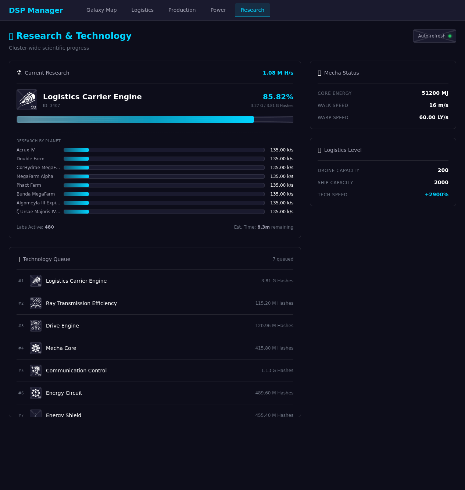

# AI Agent for Dyson Sphere Program

This project enables an AI agent to analyze and interact with "Dyson Sphere Program" (DSP) using the Model Context Protocol (MCP).

## Architecture

```
┌──────────────────────────┐         ┌─────────────────────────┐         ┌──────────────────────┐
│  Dyson Sphere Program    │         │   Python MCP Server     │         │   MCP Client         │
│  ┌────────────────────┐  │         │   (api/server.py)       │         │  (AI Agent)          │
│  │                    │  │         │                         │         │                      │
│  │  Game Engine       │  │         │  ┌───────────────────┐  │         │  • Claude Code CLI   │
│  │  (Unity)           │  │         │  │   FastMCP Server  │  │         │  • Claude Desktop    │
│  │                    │  │  JSON   │  │   :8001/mcp       │◄─┼─────────┼─ • Custom Clients    │
│  └─────────┬──────────┘  │  -RPC   │  │   (HTTP)          │  │   HTTP  │                      │
│            │             │  over   │  └───────────────────┘  │  :8001  │  Requests:           │
│  ┌─────────▼──────────┐  │  WS     │           │             │         │  - get_game_info     │
│  │   BepInEx Plugin   │  │ :18181  │           ▼             │         │  - get_research_...  │
│  │   (DSPMCP.dll)     ├──┼────────►│  ┌───────────────────┐  │         │  - list_planets      │
│  │                    │  │         │  │   WebSocket       │  │         │  - etc. (12 tools)   │
│  │  • WebSocket       │  │         │  │   Client          │  │         │                      │
│  │    Server :18181   │  │         │  └───────────────────┘  │         │  Responses:          │
│  │  • JSON-RPC        │  │         │                         │         │  - Game data (JSON)  │
│  │    Handlers        │◄─┼─────────┤  ┌───────────────────┐  │         │                      │
│  │  • Game Data       │  │         │  │   FastAPI Server  │  │         │                      │
│  │    Access          │  │         │  │   :8000           │  │         │                      │
│  └────────────────────┘  │         │  │   (REST API)      │  │         │                      │
│                          │         │  └───────────────────┘  │         │                      │
└──────────────────────────┘         └─────────────────────────┘         └──────────────────────┘
     Game Runtime                        MCP Server Bridge                     AI Interface
```

**Data Flow:**

1. **Game → Python Server:** DSPMCP.dll exposes game data via WebSocket server (`:18181`) using JSON-RPC protocol
2. **Python Server → MCP Client:** FastMCP server exposes 12 tools via HTTP (`:8001/mcp`) for AI agents to query
3. **Optional REST API:** FastAPI server (`:8000`) provides alternative HTTP endpoints for web frontends

**Components:**

1. **Game Mod (`plugin/`)**: A C# BepInEx mod that embeds a WebSocket server inside the game. It exposes internal game data via JSON-RPC protocol.
2. **MCP Server (`api/`)**: A Python server using `fastmcp` and `FastAPI`. It connects to the Game Mod via WebSocket and exposes high-level MCP Tools to AI agents that support HTTP MCP transport.

---

## Requirements

### Game & Mod Manager
- **[Dyson Sphere Program](https://store.steampowered.com/app/1366540/)** (Steam)
- **[BepInEx 5.4.x](https://github.com/BepInEx/BepInEx)** - Mod framework for Unity games
- **[r2modman](https://github.com/ebkr/r2modmanPlus)** (recommended) - Mod manager for easy BepInEx installation
  - **Note:** r2modman is not strictly required, but the build scripts assume the default r2modman installation directory (`%AppData%\r2modmanPlus-local\DysonSphereProgram\profiles\Default\BepInEx\plugins\`). If you're using a custom BepInEx installation, update the paths in `plugin/src/DSPMCP/DSPMCP.csproj` and `plugin/cmds/build-plugin.sh`.

### Development Tools
- **[.NET SDK 6.0+](https://dotnet.microsoft.com/download)** - For building the C# plugin
- **[Python 3.8+](https://www.python.org/downloads/)** - For running the MCP server
- **[uv](https://github.com/astral-sh/uv)** (recommended) - Fast Python package manager and runner

### AI Agent
- Any AI agent with **HTTP MCP transport** support (e.g., Claude Code CLI, Claude Desktop, or custom MCP clients)

---

## Setup & Usage

### 1. Install the Game Mod (Plugin)

**Build the plugin:**
```bash
./plugin/cmds/build-plugin.sh
```

This compiles the C# plugin and automatically deploys it to your r2modman profile.

**Run the game:**
Start Dyson Sphere Program via r2modman or Steam.

**Verify it works:**
```bash
./plugin/cmds/check-log.sh
```

Look for the message: `WebSocket Server started on ws://localhost:18181/`

---

### 2. Run the MCP Server

**Start the server:**
```bash
cd api
uv run python server.py
```

The server will start:
- **MCP Server** on `http://localhost:8001/mcp` (HTTP transport)
- **REST API** on `http://localhost:8000` (optional, for web frontends)

**Test with mock data (without running the game):**
```bash
cd api
DSP_USE_MOCK=true uv run python server.py
```

---

### 3. Connect Your AI Agent

**For Claude Code CLI:**
```bash
claude mcp add --transport http DysonSphereMCP http://localhost:8001/mcp
```

**For other MCP clients:**
Configure HTTP transport to `http://localhost:8001/mcp`

**Reconnect after updates:**
- **Claude Code:** Type `/mcp` and select "DysonSphereMCP" to reconnect
- **Claude Desktop:** Restart the application

---

## Available MCP Tools (12 Total)

### Game Information
- **`get_game_info`**: Get basic game info including version, current planet, and star count
- **`get_galaxy_details`**: Get galaxy seed, star count, birth planet/star, and habitable planet count

### Planets & Stars
- **`list_planets`**: List all planets with basic details
- **`get_planet_resources(planetId)`**: Get resource veins and deposits on a specific planet
- **`get_stars`**: List all stars with details (position, type, temperature, luminosity, planet count)

### Research & Technology
- **`get_research_progress`**: Get current research tech, progress percentage, and total hash rate
- **`get_research_by_planet`**: Get research hash rate breakdown by planet (lab counts, working/idle labs, hash/sec)
- **`get_tech_queue`**: Get the current research queue with progress on each queued technology
- **`get_upgrades`**: Get mecha upgrades, research speed multipliers, logistics capacities, and Dyson sphere unlocks
- **`get_lab_details(planetId)`**: Get details for all labs on a specific planet, including individual research speed

### Logistics
- **`list_ils_per_planet`**: List all Interstellar Logistics Stations (ILS) grouped by planet, including drone/ship counts, warper status, energy levels, and item storage with logistics modes (supply/demand)
- **`get_ils_details(planetId)`**: Get detailed information for all ILS stations on a specific planet
- **`get_shipping_routes_for_ils(stationId)`**: Get shipping routes for a given ILS (by stationId/gid), showing outgoing and incoming ships
- **`get_planet_routes(planetId)`**: Get all incoming and outgoing shipping routes for a specific planet
- **`find_item_transport(itemId)`**: Find all ships currently transporting a specific item (by ID)

---

## REST API Endpoints (Optional)

The Python server also exposes REST API endpoints on port 8000:

```
GET /api/info                      # Game information
GET /api/research                  # Research progress
GET /api/research/by-planet        # Per-planet research breakdown
GET /api/research/tech-queue       # Research queue
GET /api/research/upgrades         # Upgrades and unlocks
GET /api/planets                   # List all planets
GET /api/planets/{id}/resources    # Planet resources
GET /api/planets/{id}/labs         # Lab details for planet
GET /api/planets/{id}/ils          # ILS details for planet
GET /api/stars                     # List all stars
GET /api/ils                       # All ILS stations
GET /api/galaxy                    # Galaxy details
GET /api/config                    # Server configuration
```

---

## Web Frontend

A modern, real-time dashboard for visualizing your cluster's status. Built with **SvelteKit** and **Tailwind CSS**.

### Features
- **Power Grid**: Real-time power generation/consumption breakdown by planet and generator type.
- **Research**: Track current tech progress, queue, and hash rate contribution per planet.
- **Production**: Monitor global production rates and identify bottlenecks (coming soon).
- **Logistics**: View interstellar transport routes and station status (coming soon).

### Screenshots

**Power Grid Overview**


**Research & Technology**


### Running the Frontend

```bash
./cmds/run-web.sh
```

Access the dashboard at `http://localhost:5173`.

---

## Development

See [`AGENTS.md`](AGENTS.md) for:
- Development workflow and build instructions
- Debugging tips and log viewing
- MCP server setup and reconnection
- Troubleshooting guide

See [`PLAN.md`](PLAN.md) for:
- Implementation phases and roadmap
- Future feature ideas
- Architecture decisions

---

## Project Structure

```
dyson-sphere-mcp/
├── plugin/               # C# BepInEx game mod
│   ├── src/DSPMCP/      # Plugin source code
│   └── cmds/            # Build and deployment scripts
├── api/                  # Python MCP server
│   ├── server.py        # FastMCP + FastAPI server
│   ├── mock/            # Mock data for testing
│   └── pyproject.toml   # Python dependencies (uv)
├── README.md            # This file
├── AGENTS.md            # Development guide
└── PLAN.md              # Implementation roadmap
```

---

## Requirements

- **Game**: Dyson Sphere Program (Steam)
- **Mod Manager**: r2modman (for BepInEx)
- **.NET SDK**: For building the C# plugin
- **Python 3.8+**: For running the MCP server
- **uv**: Python package manager (recommended)
- **Claude Code CLI**: For using MCP tools

---

## License

MIT License - See LICENSE file for details.
